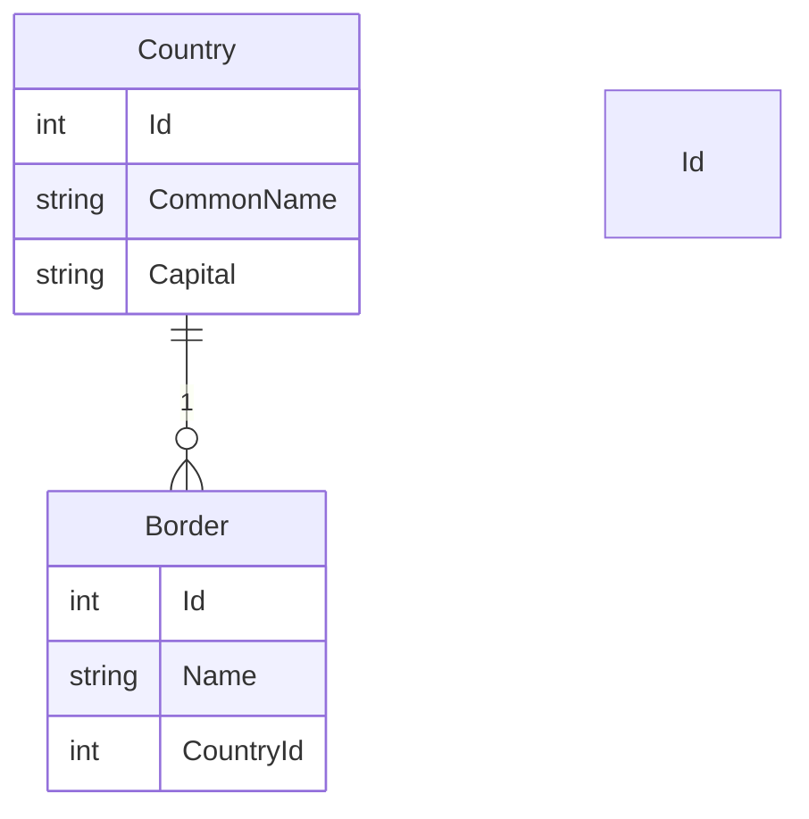
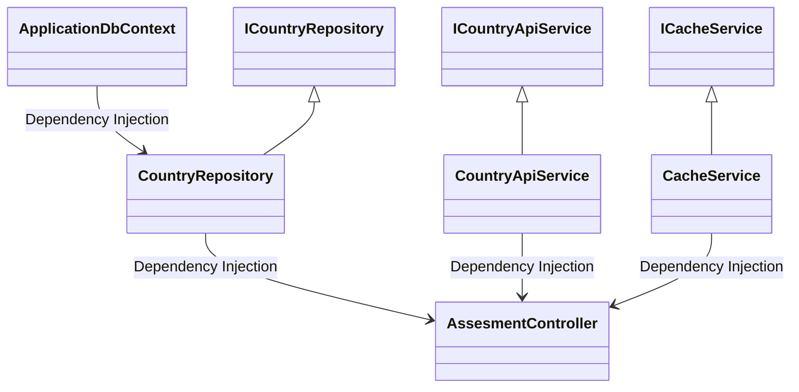


# Assessment 

## Table of Contents

- [Introduction](#introduction)
- [Installation](#installation)
- [Endpoints](#endpoints)
- [Architecture](#architecture)
- [Testing](#testing)

## Introduction
This REST API is exposing FindSecondLargest and GetCountries endpoints.Its fetching it's data for the latter from the 3rd party api 
<a href="https://restcountries.com/v3.1/all">Rest Countries</a> and saves it to a cache using a Docker Redis container. 
It also stores the data inside a Microsoft SQL Server database.
Finally the endpoints are unit tested.
## Installation

Follow these 5 easy steps to install and set up the project:
###### Step 1. Clone the Repository
```bash
# Clone the repository
git clone https://github.com/nikoletaxvs/Assessment
cd Assessment
```
###### Step2 .Install necessary NuGet packages
```bash
#Restore NuGet Packages
dotnet restore
```
###### Step 3.Create a database migration
```bash
# Create a database migration
dotnet ef migrations add InitialCreate -c ApplicationDbContext

# Update the database
dotnet ef database update -c ApplicationDbContext
```
###### Step 4.Setup Redis with Docker
```bash
#If redis is not pulled yet, open powershell as an administrator and run, otherwise skip this step
docker pull redis

#Then run
docker run -p 6379:6379 --name my-redis -d redis #if that's done use docker start
```

###### Step 5.Build and Run the API
```bash
# Build the project
dotnet build

# Run the API
dotnet run
```

## Endpoints

##### 1. FindSecondLargest

Endpoint: POST /FindSecondLargest

###### Input:

    A JSON body of RequestObj.

###### Output:

    The second largest integer of the array gets returned.

###### Response:

    Status 200: Success. Returns the second largest integer.
    Status 400: Bad Request. The given array should have at least two integers.
    Status 500: Internal Server Error.

###### Example:
```json

{
  "RequestArrayObj": [4, 7, 1, 9, 3]
}
```
###### Response:
```json
{
  "secondLargest": 7
}
```

##### 2. GetCountries

Endpoint: GET /GetCountries

###### Output:

    IEnumerable<CountryDto> with common name, capital, and borders as its fields, retrieved from the third-party API, cache, or the database.

###### Response:

    Status 200: Success. Returns the list of country dtos.
    Status 500: Internal Server Error.
###### Example:
###### Response:

  ```json
[
  {
    "commonName": "string",
    "capital": "string",
    "borders": [
      {
        "name": "string"
      }
    ]
  }
]
```
##### 3. DeleteCountriesUtility

Endpoint: GET /DeleteAllCountriesUtility

###### Description:
This utility endpoint deletes all countries and their borders.

###### Response:

    Status 200: Success. Deleted all countries and their borders.
    Status 400: Bad Request. There was some issue.
    Status 500: Internal Server Error.
## Architecture 

##### Database
The `Country` class has a one-to-many relationship with the `Border` class

#####  Classes


In the application's architecture:

-   **Data Layer:** The `ApplicationDbContext` facilitates database operations by injecting the `CountryRepository`.
    
-   **Service Layer:** Services (`CountryApiService`, `CacheService`, `CountryRepository`) implement interfaces (`ICountryApiService`, `ICacheService`, `ICountryRepository`) for structured functionality.
    
-   **Dependency Injection:** Services are injected into `AssesmentController` to manage HTTP requests. This design emphasizes modularity and separation of concerns, enhancing the application's maintainability and scalability.

## Testing 
This rest api has been tested with XUnit. The xunit test project can be found in this repository : <a href="https://github.com/nikoletaxvs/Assessment.Tests">Tests Repository</a>
